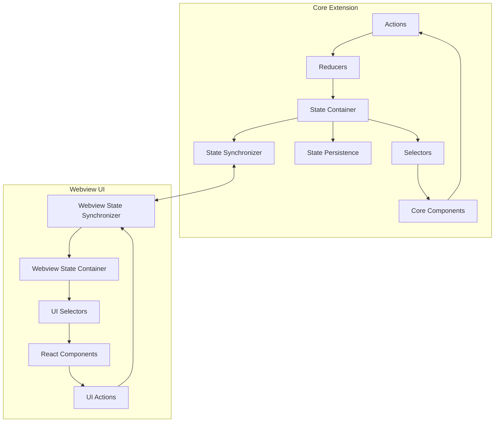

# Cline State Architecture Design

This document outlines the proposed architecture for improving Cline's state management system, based on the findings from the [State Management Audit](./state-management-audit.md). The goal is to create a more robust, type-safe, and maintainable state management system that addresses the identified pain points.

## Design Principles

The proposed state architecture is guided by the following principles:

1. **Unidirectional Data Flow**: State changes follow a predictable path, making it easier to track and debug.
2. **Single Source of Truth**: Each piece of state has a clear owner and a single definitive location.
3. **Type Safety**: All state transitions and message passing are strongly typed.
4. **Separation of Concerns**: Clear boundaries between different parts of the state.
5. **Resilience**: The system can recover from errors and disconnections gracefully.
6. **Developer Experience**: The architecture should be intuitive and provide good tooling for development.

## High-Level Architecture

The proposed architecture follows a Redux-inspired pattern, adapted for the VSCode extension environment with its unique core-webview separation:



## Core Components

### 1. State Container

The State Container is the central repository for all application state. It replaces the current distributed state management approach with a more centralized and structured system.

```typescript
// src/core/state/StateContainer.ts
export class StateContainer {
  private state: AppState;
  private listeners: Set<StateChangeListener>;
  
  constructor(initialState: AppState) {
    this.state = initialState;
    this.listeners = new Set();
  }
  
  getState(): Readonly<AppState> {
    return this.state;
  }
  
  dispatch(action: Action): void {
    const nextState = reducer(this.state, action);
    if (nextState !== this.state) {
      this.state = nextState;
      this.notifyListeners();
    }
  }
  
  subscribe(listener: StateChangeListener): () => void {
    this.listeners.add(listener);
    return () => {
      this.listeners.delete(listener);
    };
  }
  
  private notifyListeners(): void {
    for (const listener of this.listeners) {
      listener(this.state);
    }
  }
}
```

### 2. Actions and Action Creators

Actions are plain objects that describe state changes. Action creators are functions that create actions, potentially with side effects.

```typescript
// src/core/state/actions/types.ts
export enum ActionType {
  UPDATE_API_CONFIGURATION = 'UPDATE_API_CONFIGURATION',
  SET_CUSTOM_INSTRUCTIONS = 'SET_CUSTOM_INSTRUCTIONS',
  ADD_TASK_TO_HISTORY = 'ADD_TASK_TO_HISTORY',
  // ... other action types
}

export interface Action {
  type: ActionType;
  payload?: any;
}

// src/core/state/actions/apiConfigActions.ts
export const updateApiConfiguration = (config: ApiConfiguration): Action => ({
  type: ActionType.UPDATE_API_CONFIGURATION,
  payload: config,
});

// With side effects (thunk-like)
export const fetchOpenRouterModels = () => async (dispatch: Dispatch, getState: () => AppState) => {
  try {
    const models = await fetchModelsFromApi();
    dispatch({
      type: ActionType.SET_OPENROUTER_MODELS,
      payload: models,
    });
  } catch (error) {
    dispatch({
      type: ActionType.API_ERROR,
      payload: error.message,
    });
  }
};
```

### 3. Reducers

Reducers are pure functions that take the current state and an action, and return a new state.

```typescript
// src/core/state/reducers/index.ts
export const reducer = (state: AppState, action: Action): AppState => {
  switch (action.type) {
    case ActionType.UPDATE_API_CONFIGURATION:
      return {
        ...state,
        apiConfiguration: action.payload,
      };
    case ActionType.SET_CUSTOM_INSTRUCTIONS:
      return {
        ...state,
        customInstructions: action.payload,
      };
    // ... other action handlers
    default:
      return state;
  }
};
```

### 4. Selectors

Selectors are functions that extract specific pieces of state.

```typescript
// src/core/state/selectors/index.ts
export const selectApiConfiguration = (state: AppState): ApiConfiguration => 
  state.apiConfiguration;

export const selectCustomInstructions = (state: AppState): string | undefined => 
  state.customInstructions;

export const selectCurrentTask = (state: AppState): HistoryItem | undefined => 
  state.taskHistory.find(task => task.id === state.currentTaskId);
```

### 5. State Persistence

The State Persistence layer handles saving state to VSCode's storage mechanisms.

```typescript
// src/core/state/persistence/StatePersistence.ts
export class StatePersistence {
  constructor(
    private context: vscode.ExtensionContext,
    private stateContainer: StateContainer
  ) {
    // Subscribe to state changes
    this.stateContainer.subscribe(this.persistState);
  }
  
  private persistState = async (state: AppState): Promise<void> => {
    // Persist global state
    await this.persistGlobalState(state);
    
    // Persist secrets
    await this.persistSecrets(state);
  };
  
  private async persistGlobalState(state: AppState): Promise<void> {
    // Persist each piece of global state
    await this.context.globalState.update('apiProvider', state.apiConfiguration.apiProvider);
    await this.context.globalState.update('apiModelId', state.apiConfiguration.apiModelId);
    // ... other global state updates
  }
  
  private async persistSecrets(state: AppState): Promise<void> {
    // Persist secrets
    if (state.apiConfiguration.apiKey) {
      await this.context.secrets.store('apiKey', state.apiConfiguration.apiKey);
    } else {
      await this.context.secrets.delete('apiKey');
    }
    // ... other secrets updates
  }
  
  async loadPersistedState(): Promise<Partial<AppState>> {
    // Load state from storage
    const apiProvider = await this.context.globalState.get<ApiProvider>('apiProvider');
    const apiModelId = await this.context.globalState.get<string>('apiModelId');
    const apiKey = await this.context.secrets.get('apiKey');
    
    // ... load other state
    
    return {
      apiConfiguration: {
        apiProvider,
        apiModelId,
        apiKey,
        // ... other API configuration
      },
      // ... other state
    };
  }
}
```

### 6. State Synchronizer

The State Synchronizer handles communication between the core extension and webview.

```typescript
// src/core/state/sync/StateSynchronizer.ts
export class StateSynchronizer {
  constructor(
    private stateContainer: StateContainer,
    private webviewProvider: WebviewProvider
  ) {
    // Subscribe to state changes
    this.stateContainer.subscribe(this.syncStateToWebview);
    
    // Listen for messages from webview
    this.webviewProvider.onDidReceiveMessage(this.handleWebviewMessage);
  }
  
  private syncStateToWebview = (state: AppState): void => {
    // Create a sanitized version of the state (no secrets)
    const webviewState = this.createWebviewState(state);
    
    // Send state to webview
    this.webviewProvider.postMessage({
      type: 'state',
      state: webviewState,
    });
  };
  
  private createWebviewState(state: AppState): WebviewState {
    // Create a sanitized version of the state
    return {
      version: state.version,
      apiConfiguration: {
        ...state.apiConfiguration,
        // Remove secrets
        apiKey: undefined,
        openRouterApiKey: undefined,
        // ... other secrets
      },
      // ... other state
    };
  }
  
  private handleWebviewMessage = (message: WebviewMessage): void => {
    // Convert webview message to action
    const action = this.messageToAction(message);
    if (action) {
      // Dispatch action to state container
      this.stateContainer.dispatch(action);
    }
  };
  
  private messageToAction(message: WebviewMessage): Action | undefined {
    switch (message.type) {
      case 'apiConfiguration':
        return updateApiConfiguration(message.apiConfiguration!);
      case 'customInstructions':
        return setCustomInstructions(message.text);
      // ... other message types
      default:
        return undefined;
    }
  }
}
```

## Webview Components

### 1. Webview State Container

The Webview State Container is a simplified version of the core state container, adapted for React.

```typescript
// webview-ui/src/state/WebviewStateContainer.ts
export class WebviewStateContainer {
  private state: WebviewState;
  private listeners: Set<StateChangeListener>;
  
  constructor(initialState: WebviewState) {
    this.state = initialState;
    this.listeners = new Set();
    
    // Listen for messages from extension
    window.addEventListener('message', this.handleExtensionMessage);
  }
  
  getState(): Readonly<WebviewState> {
    return this.state;
  }
  
  dispatch(action: WebviewAction): void {
    // Handle local actions
    const nextState = webviewReducer(this.state, action);
    if (nextState !== this.state) {
      this.state = nextState;
      this.notifyListeners();
    }
    
    // Send action to extension if needed
    if (action.sendToExtension) {
      this.sendMessageToExtension(action.toExtensionMessage());
    }
  }
  
  subscribe(listener: StateChangeListener): () => void {
    this.listeners.add(listener);
    return () => {
      this.listeners.delete(listener);
    };
  }
  
  private notifyListeners(): void {
    for (const listener of this.listeners) {
      listener(this.state);
    }
  }
  
  private handleExtensionMessage = (event: MessageEvent): void => {
    const message: ExtensionMessage = event.data;
    
    if (message.type === 'state') {
      // Update entire state
      this.state = message.state!;
      this.notifyListeners();
    } else {
      // Handle other message types
      const action = this.messageToAction(message);
      if (action) {
        const nextState = webviewReducer(this.state, action);
        if (nextState !== this.state) {
          this.state = nextState;
          this.notifyListeners();
        }
      }
    }
  };
  
  private messageToAction(message: ExtensionMessage): WebviewAction | undefined {
    switch (message.type) {
      case 'partialMessage':
        return updatePartialMessage(message.partialMessage!);
      // ... other message types
      default:
        return undefined;
    }
  }
  
  private sendMessageToExtension(message: WebviewMessage): void {
    vscode.postMessage(message);
  }
}
```

### 2. React Integration

The React integration provides hooks and components for accessing the state.

```typescript
// webview-ui/src/state/WebviewStateContext.tsx
export const WebviewStateContext = createContext<WebviewStateContextValue | undefined>(undefined);

export const WebviewStateProvider: React.FC<{
  children: React.ReactNode;
  initialState: WebviewState;
}> = ({ children, initialState }) => {
  const stateContainerRef = useRef<WebviewStateContainer>(
    new WebviewStateContainer(initialState)
  );
  const [state, setState] = useState<WebviewState>(initialState);
  
  useEffect(() => {
    const unsubscribe = stateContainerRef.current.subscribe(setState);
    return unsubscribe;
  }, []);
  
  const dispatch = useCallback((action: WebviewAction) => {
    stateContainerRef.current.dispatch(action);
  }, []);
  
  const value: WebviewStateContextValue = {
    state,
    dispatch,
  };
  
  return (
    <WebviewStateContext.Provider value={value}>
      {children}
    </WebviewStateContext.Provider>
  );
};

export const useWebviewState = (): WebviewStateContextValue => {
  const context = useContext(WebviewStateContext);
  if (context === undefined) {
    throw new Error('useWebviewState must be used within a WebviewStateProvider');
  }
  return context;
};

// Custom hooks for specific state slices
export const useApiConfiguration = (): [ApiConfiguration, (config: ApiConfiguration) => void] => {
  const { state, dispatch } = useWebviewState();
  const setApiConfiguration = useCallback((config: ApiConfiguration) => {
    dispatch(updateApiConfiguration(config));
  }, [dispatch]);
  
  return [state.apiConfiguration, setApiConfiguration];
};
```

## Type Definitions

### 1. State Types

```typescript
// src/shared/state/types.ts
export interface AppState {
  version: string;
  apiConfiguration: ApiConfiguration;
  customInstructions?: string;
  taskHistory: HistoryItem[];
  currentTaskId?: string;
  clineMessages: ClineMessage[];
  autoApprovalSettings: AutoApprovalSettings;
  browserSettings: BrowserSettings;
  chatSettings: ChatSettings;
  userInfo?: UserInfo;
  telemetrySetting: TelemetrySetting;
  // ... other state
}

// Subset of state that is sent to webview
export interface WebviewState {
  version: string;
  apiConfiguration: Omit<ApiConfiguration, 'apiKey' | 'openRouterApiKey' | /* other secrets */>;
  customInstructions?: string;
  taskHistory: HistoryItem[];
  currentTaskId?: string;
  clineMessages: ClineMessage[];
  autoApprovalSettings: AutoApprovalSettings;
  browserSettings: BrowserSettings;
  chatSettings: ChatSettings;
  userInfo?: Omit<UserInfo, /* sensitive fields */>;
  telemetrySetting: TelemetrySetting;
  // ... other state
}
```

### 2. Action Types

```typescript
// src/shared/state/actions.ts
export enum ActionType {
  // API Configuration
  UPDATE_API_CONFIGURATION = 'UPDATE_API_CONFIGURATION',
  SET_API_PROVIDER = 'SET_API_PROVIDER',
  SET_API_MODEL_ID = 'SET_API_MODEL_ID',
  SET_API_KEY = 'SET_API_KEY',
  
  // Custom Instructions
  SET_CUSTOM_INSTRUCTIONS = 'SET_CUSTOM_INSTRUCTIONS',
  
  // Task Management
  ADD_TASK_TO_HISTORY = 'ADD_TASK_TO_HISTORY',
  SET_CURRENT_TASK = 'SET_CURRENT_TASK',
  DELETE_TASK = 'DELETE_TASK',
  
  // Messages
  ADD_MESSAGE = 'ADD_MESSAGE',
  UPDATE_PARTIAL_MESSAGE = 'UPDATE_PARTIAL_MESSAGE',
  CLEAR_MESSAGES = 'CLEAR_MESSAGES',
  
  // Settings
  UPDATE_AUTO_APPROVAL_SETTINGS = 'UPDATE_AUTO_APPROVAL_SETTINGS',
  UPDATE_BROWSER_SETTINGS = 'UPDATE_BROWSER_SETTINGS',
  UPDATE_CHAT_SETTINGS = 'UPDATE_CHAT_SETTINGS',
  SET_TELEMETRY_SETTING = 'SET_TELEMETRY_SETTING',
  
  // User
  SET_USER_INFO = 'SET_USER_INFO',
  SIGN_OUT = 'SIGN_OUT',
  
  // ... other action types
}

export interface Action {
  type: ActionType;
  payload?: any;
}

// Type-safe action creators
export const updateApiConfiguration = (config: ApiConfiguration): Action => ({
  type: ActionType.UPDATE_API_CONFIGURATION,
  payload: config,
});

export const setCustomInstructions = (instructions?: string): Action => ({
  type: ActionType.SET_CUSTOM_INSTRUCTIONS,
  payload: instructions,
});

// ... other action creators
```

### 3. Message Types

```typescript
// src/shared/messages/types.ts
export enum MessageType {
  // Core to Webview
  STATE_UPDATE = 'state',
  PARTIAL_MESSAGE = 'partialMessage',
  THEME_UPDATE = 'theme',
  WORKSPACE_UPDATED = 'workspaceUpdated',
  OPENROUTER_MODELS = 'openRouterModels',
  OPENAI_MODELS = 'openAiModels',
  MCP_SERVERS = 'mcpServers',
  MCP_MARKETPLACE_CATALOG = 'mcpMarketplaceCatalog',
  
  // Webview to Core
  API_CONFIGURATION = 'apiConfiguration',
  CUSTOM_INSTRUCTIONS = 'customInstructions',
  WEBVIEW_DID_LAUNCH = 'webviewDidLaunch',
  NEW_TASK = 'newTask',
  ASK_RESPONSE = 'askResponse',
  CLEAR_TASK = 'clearTask',
  
  // ... other message types
}

// Base message interface
export interface Message {
  type: MessageType;
}

// Core to Webview messages
export interface StateUpdateMessage extends Message {
  type: MessageType.STATE_UPDATE;
  state: WebviewState;
}

export interface PartialMessageMessage extends Message {
  type: MessageType.PARTIAL_MESSAGE;
  partialMessage: ClineMessage;
}

// ... other message types

// Webview to Core messages
export interface ApiConfigurationMessage extends Message {
  type: MessageType.API_CONFIGURATION;
  apiConfiguration: ApiConfiguration;
}

export interface CustomInstructionsMessage extends Message {
  type: MessageType.CUSTOM_INSTRUCTIONS;
  text?: string;
}

// ... other message types

// Union type for all messages
export type ExtensionMessage = 
  | StateUpdateMessage
  | PartialMessageMessage
  | /* other core to webview messages */;

export type WebviewMessage = 
  | ApiConfigurationMessage
  | CustomInstructionsMessage
  | /* other webview to core messages */;
```

## Implementation Strategy

The implementation of this architecture will be phased to minimize disruption to the existing codebase:

### Phase 1: Core State Container

1. Create the core state container and types
2. Implement basic reducers and actions
3. Create a compatibility layer to work with existing code
4. Gradually migrate state management from ClineProvider to the state container

### Phase 2: State Persistence

1. Implement the state persistence layer
2. Migrate storage operations from ClineProvider to the persistence layer
3. Add state versioning and migration support

### Phase 3: Webview State Management

1. Create the webview state container
2. Implement React integration
3. Gradually migrate from ExtensionStateContext to the new system

### Phase 4: State Synchronization

1. Implement the state synchronizer
2. Refine message types and serialization
3. Add error handling and recovery mechanisms

### Phase 5: Developer Experience

1. Add state debugging tools
2. Implement state change logging
3. Create visualization helpers for state flow

## Conclusion

This architecture design provides a comprehensive approach to improving Cline's state management. By implementing a unidirectional data flow with strong typing and clear ownership, we can address the pain points identified in the audit while improving maintainability and developer experience.

The phased implementation strategy allows for incremental improvements without disrupting the existing functionality, ensuring a smooth transition to the new architecture.
