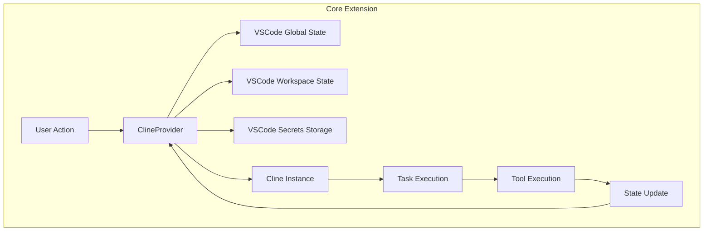
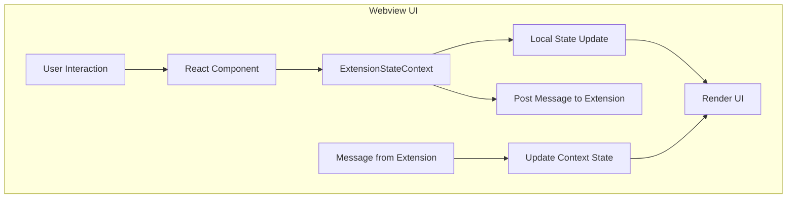
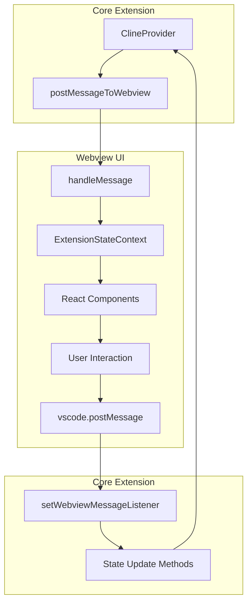

# Cline State Management Audit

## Current State Management Approach

The Cline extension uses a hybrid state management approach that spans both the core extension (backend) and the webview UI (frontend). This document provides a comprehensive audit of the current state management implementation, identifies pain points, and maps the state flow across components.

### Core Extension State Management

The core extension state is managed by the `ClineProvider` class in `src/core/webview/ClineProvider.ts`, which serves as the single source of truth for the extension's state. It manages multiple types of persistent storage:

1. **Global State**: Stored across all VSCode instances using `context.globalState`. Used for settings and data that should persist globally.
2. **Workspace State**: Specific to the current workspace using `context.workspaceState`. Used for task-specific data and settings.
3. **Secrets Storage**: Secure storage for sensitive information like API keys using `context.secrets`.

The `ClineProvider` handles the distribution of state to both the core extension and webview components. It also coordinates state across multiple extension instances, ensuring consistency.

Key state elements managed by `ClineProvider`:

- API configurations (provider, model, keys)
- Task history
- Custom instructions
- Auto-approval settings
- Browser settings
- Chat settings
- MCP server configurations
- User authentication information
- Telemetry settings

### Webview State Management

The webview state is managed through React context in `webview-ui/src/context/ExtensionStateContext.tsx`, which provides React components with access to the extension's state. It uses a context provider pattern and maintains local state for UI components.

Key aspects of the webview state management:

- Uses React's Context API for state distribution
- Maintains local state for UI components
- Handles real-time updates through message events
- Manages partial message updates
- Provides methods for state modifications

The context includes:

- Extension version
- Messages
- Task history
- Theme
- API configurations
- MCP servers
- Marketplace catalog
- Workspace file paths

### Communication Between Core and Webview

Communication between the core extension and webview is handled through VSCode's message passing system:

1. **Core to Webview**: The core extension sends messages to the webview using `postMessageToWebview` method, which calls `webview.postMessage` with an `ExtensionMessage` object.

2. **Webview to Core**: The webview sends messages to the core extension using `vscode.postMessage` with a `WebviewMessage` object.

The message types are defined in:
- `src/shared/ExtensionMessage.ts` (core to webview)
- `src/shared/WebviewMessage.ts` (webview to core)

## Pain Points and Challenges

### 1. State Synchronization Issues

- **Bidirectional State Updates**: The current approach requires manual synchronization of state between the core extension and webview, which can lead to inconsistencies if not handled properly.

- **Race Conditions**: When multiple state updates occur in quick succession, race conditions can occur, leading to unexpected behavior.

- **Partial Updates**: The system handles partial message updates, but this adds complexity and potential for errors.

### 2. Type Safety Concerns

- **Message Type Definitions**: While there are type definitions for messages, they are spread across multiple files and can be difficult to maintain.

- **State Transitions**: State transitions are not explicitly typed, making it harder to track and validate state changes.

- **Optional Properties**: Many state properties are optional, which can lead to null/undefined errors if not handled carefully.

### 3. State Management Complexity

- **Multiple Storage Types**: The use of multiple storage types (global state, workspace state, secrets) adds complexity to state management.

- **Distributed State Logic**: State management logic is distributed across multiple components, making it harder to reason about the overall state flow.

- **Redundant State**: Some state is duplicated between the core extension and webview, requiring careful synchronization.

### 4. Error Handling and Recovery

- **Disconnection Handling**: If the webview is disconnected from the core extension, there's no robust mechanism for state recovery.

- **Error Propagation**: Errors in state updates may not be properly propagated to the user interface.

- **State Versioning**: There's no explicit versioning of state, making it difficult to handle backward compatibility.

## State Flow Mapping

### Core Extension State Flow

### Webview State Flow

### Cross-Component State Flow

## State Categories and Ownership

### Core Extension Owned State

1. **API Configuration**
   - API provider selection
   - API keys and credentials
   - Model selection and configuration

2. **Task Management**
   - Task history
   - Task execution state
   - Checkpoint tracking

3. **Tool Execution**
   - Command execution
   - File operations
   - Browser automation

4. **Security Settings**
   - Auto-approval settings
   - Permission management
   - Authentication state

### Webview Owned State

1. **UI State**
   - Current view/panel selection
   - UI theme and appearance
   - Modal dialogs and popups

2. **User Input**
   - Message drafts
   - Form inputs
   - Selection state

3. **Transient State**
   - Hover states
   - Focus management
   - Animation states

### Shared State

1. **Messages**
   - Conversation history
   - Message content
   - Partial message updates

2. **Task Context**
   - Current task information
   - Task progress
   - Task completion status

3. **Settings**
   - User preferences
   - Feature toggles
   - Display options

## Recommendations for Improvement

Based on this audit, the following improvements are recommended:

1. **Implement Unidirectional Data Flow**
   - Adopt a more structured state management pattern with clear data flow
   - Consider using a Redux-like pattern for predictable state updates
   - Establish clear ownership of state between core and webview

2. **Enhance Type Safety**
   - Create a unified state type system
   - Implement strict typing for state transitions
   - Use discriminated unions for message types

3. **Improve State Synchronization**
   - Implement a robust synchronization protocol
   - Add versioning to state updates
   - Create conflict resolution mechanisms

4. **Simplify State Management**
   - Consolidate state storage where possible
   - Create a centralized state container
   - Implement middleware for side effects

5. **Add Error Recovery**
   - Implement state recovery mechanisms
   - Add error boundaries for state updates
   - Create fallback states for error conditions

6. **Improve Developer Experience**
   - Add state debugging tools
   - Create state visualization helpers
   - Implement state change logging

These recommendations will be further developed in the State Architecture Design phase of the State Management Refactoring project.
