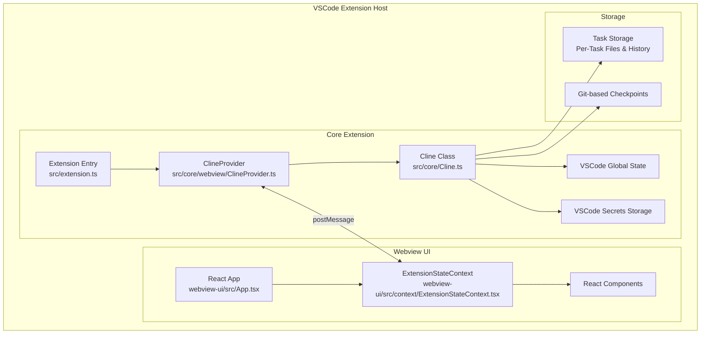

# Cline System Patterns

## System Architecture

Cline follows a modular architecture with clear separation of concerns between the core extension backend and the React-based webview frontend:

## Key Technical Decisions

1. **State Management**
   - Core extension state is managed by the ClineProvider class
   - Webview state is managed through React context (ExtensionStateContext)
   - Communication between core and webview uses VSCode's message passing system
   - Multiple storage types (global state, workspace state, secrets) for different persistence needs

2. **Task Isolation**
   - Each task runs in its own instance of the Cline class
   - Tasks have dedicated storage directories and history
   - Git-based checkpoints for tracking file changes
   - Clean separation between tasks prevents interference

3. **API Integration**
   - Support for multiple API providers through adapter pattern
   - Streaming architecture for real-time updates
   - Token tracking and context window management
   - Automatic retry and error recovery

4. **Tool Execution**
   - Strict approval workflow for all tools
   - Consistent execution patterns across tool types
   - Real-time feedback and monitoring
   - Checkpoint creation after tool execution

## Design Patterns in Use

1. **Provider Pattern**
   - ClineProvider serves as the central state provider
   - ExtensionStateContext provides React components with access to state
   - Consistent interface for state access across components

2. **Singleton Pattern**
   - Single ClineProvider instance manages all extension state
   - Ensures consistency across multiple extension instances
   - Centralizes state management and persistence

3. **Observer Pattern**
   - Components observe state changes through context
   - Real-time updates through message events
   - Reactive UI updates based on state changes

4. **Adapter Pattern**
   - Uniform interface for different API providers
   - Consistent handling of various model capabilities
   - Simplified integration of new providers

5. **Command Pattern**
   - Tools encapsulate actions as discrete commands
   - Consistent execution and approval workflow
   - Clear separation between command definition and execution

## Component Relationships

### Core Extension Components

1. **Extension Entry (src/extension.ts)**
   - Initializes the extension
   - Registers commands and views
   - Creates the ClineProvider instance

2. **ClineProvider (src/core/webview/ClineProvider.ts)**
   - Manages extension state
   - Coordinates communication with webview
   - Handles state persistence
   - Creates Cline instances for tasks

3. **Cline Class (src/core/Cline.ts)**
   - Manages task execution
   - Handles API requests and streaming
   - Coordinates tool execution
   - Manages task state and history

### Webview Components

1. **React App (webview-ui/src/App.tsx)**
   - Main entry point for the webview UI
   - Renders the chat interface
   - Manages UI state and interactions

2. **ExtensionStateContext (webview-ui/src/context/ExtensionStateContext.tsx)**
   - Provides access to extension state
   - Handles message events from the core extension
   - Manages local state for UI components
   - Provides methods for state modifications

3. **React Components**
   - Modular UI components for different features
   - Access state through the ExtensionStateContext
   - Send messages to the core extension for actions

### Storage Components

1. **Task Storage**
   - Per-task files and history
   - Conversation history
   - Tool execution results
   - Task metadata

2. **Checkpoint System**
   - Git-based tracking of file changes
   - Ability to compare and restore checkpoints
   - Automatic checkpoint creation after tool execution

## Data Flow Patterns

1. **API Request Flow**
   - User input is processed and formatted
   - API request is made with appropriate context
   - Response is streamed and parsed into content blocks
   - Content blocks are presented to the user
   - Tool executions are handled as needed

2. **Tool Execution Flow**
   - Tool use is identified in API response
   - User approval is requested (or auto-approved based on settings)
   - Tool is executed with appropriate parameters
   - Result is captured and formatted
   - Checkpoint is created
   - Result is sent back to the API for continuation

3. **State Synchronization Flow**
   - Core extension updates state
   - State changes are serialized and sent to webview
   - Webview updates local state based on messages
   - UI components react to state changes
   - User interactions trigger messages back to core extension
