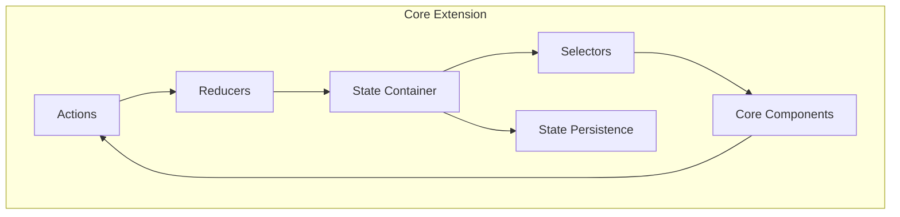

# Cline State Management System

This directory contains the implementation of Cline's state management system, which follows a Redux-inspired architecture adapted for VSCode extensions.

## Architecture Overview

The state management system is organized around the following key components:



## Directory Structure

```
src/core/state/
├── index.ts                         # Main exports
├── StateContainer.ts                # State container implementation
├── types.ts                         # State type definitions
├── ClineProviderIntegration.ts      # Integration with ClineProvider
├── actions/                         # Action creators
│   ├── index.ts                     # Action exports
│   ├── types.ts                     # Action type definitions
│   ├── apiConfigActions.ts          # API configuration actions
│   ├── taskActions.ts               # Task management actions
│   ├── messageActions.ts            # Message actions
│   ├── settingsActions.ts           # Settings actions
│   ├── userActions.ts               # User actions
│   └── stateActions.ts              # State management actions
├── reducers/                        # Reducers
│   ├── index.ts                     # Root reducer
│   ├── apiConfigReducer.ts          # API configuration reducer
│   ├── taskReducer.ts               # Task management reducer
│   ├── messageReducer.ts            # Message reducer
│   ├── settingsReducer.ts           # Settings reducer
│   └── userReducer.ts               # User reducer
├── selectors/                       # Selectors
│   ├── index.ts                     # Selector exports
│   ├── apiConfigSelectors.ts        # API configuration selectors
│   ├── taskSelectors.ts             # Task management selectors
│   ├── messageSelectors.ts          # Message selectors
│   ├── settingsSelectors.ts         # Settings selectors
│   └── userSelectors.ts             # User selectors
└── persistence/                     # State persistence
    ├── index.ts                     # Persistence exports
    └── StatePersistence.ts          # State persistence implementation
```

## Key Components

### State Container

The `StateContainer` class is the central piece of the state management system. It holds the current state and dispatches actions to update it.

```typescript
const stateContainer = getStateContainer(initialState);
stateContainer.dispatch(updateApiConfiguration(config));
const state = stateContainer.getState();
```

### Actions

Actions are plain objects that describe state changes. Action creators are functions that create actions.

```typescript
// Action type
export enum ActionType {
  UPDATE_API_CONFIGURATION = 'UPDATE_API_CONFIGURATION',
  // ...
}

// Action creator
export const updateApiConfiguration = (config: ApiConfiguration): Action => ({
  type: ActionType.UPDATE_API_CONFIGURATION,
  payload: config,
});
```

### Reducers

Reducers are pure functions that take the current state and an action, and return a new state.

```typescript
export const apiConfigReducer = (state: ApiConfiguration = {}, action: Action): ApiConfiguration => {
  switch (action.type) {
    case ActionType.UPDATE_API_CONFIGURATION:
      return {
        ...state,
        ...action.payload,
      };
    // ...
    default:
      return state;
  }
};
```

### Selectors

Selectors are functions that extract specific pieces of state.

```typescript
export const selectApiConfiguration = (state: AppState): ApiConfiguration => 
  state.apiConfiguration;
```

### State Persistence

The `StatePersistence` class handles saving and loading state from VSCode's storage mechanisms.

```typescript
const statePersistence = getStatePersistence(context, stateContainer);
const persistedState = await statePersistence.loadPersistedState();
```

## Integration with ClineProvider

The `ClineProviderIntegration` class provides a bridge between the state management system and the `ClineProvider` class.

```typescript
const stateIntegration = new ClineProviderIntegration(context);
await stateIntegration.updateApiConfiguration(config);
```

## Usage Example

```typescript
import { ClineProviderIntegration } from '../core/state';

export class ClineProvider implements vscode.WebviewViewProvider {
  private stateIntegration: ClineProviderIntegration;
  
  constructor(readonly context: vscode.ExtensionContext) {
    this.stateIntegration = new ClineProviderIntegration(context);
  }
  
  async updateApiConfiguration(config: ApiConfiguration): Promise<void> {
    await this.stateIntegration.updateApiConfiguration(config);
  }
  
  // ...
}
```

## Benefits

- **Unidirectional Data Flow**: State changes follow a predictable path through actions and reducers.
- **Type Safety**: All state transitions are strongly typed with explicit action types.
- **Separation of Concerns**: State logic is organized by domain, making it easier to maintain.
- **Single Source of Truth**: The state container serves as the single source of truth for all state.
- **Persistence**: State is automatically persisted to VSCode's storage mechanisms.
